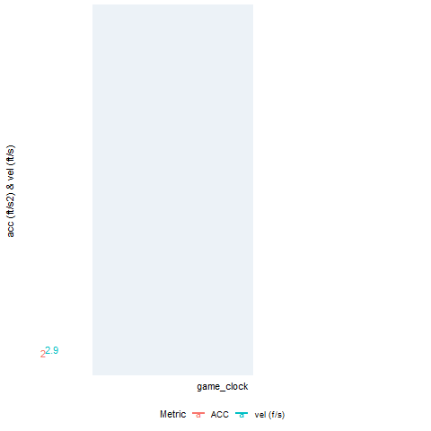

# sportVU NBA Athlete Tracking

A working document looking at different physical metrics that can be derived from NBA plays using [SportVU](https://www.nbastuffer.com/analytics101/sportvu-data/) tracking data. 

### Example Image

Below is a dashboard looking at the motion of the actual play along with calculated acceleration and running speed for the Detroit Pistons players. 

  

### Data

SportVU in no longer used in the NBA, however a subset of games for the 2015/16 season can be found [here](https://github.com/linouk23/NBA-Player-Movements/tree/master/data/2016.NBA.Raw.SportVU.Game.Logs)

### Importing data

After downloading the games of interest to our working directory, I will import the data using the [sportvu_df()](https://rdrr.io/github/imadmali/NBAsportvu/man/sportvu_df.html) function. It also converts the data from json to a data frame. 

For this example we will use the Pistons vs Hawks game on Oct 27th, 2015 (id: 0021500001). Videohighlights available [here](https://www.youtube.com/watch?v=dNtmLm5D7dI). From this game, we will select the play id 388 consisting of a fast break for the Pistons resulting in a driving layup by Jodie Meeks.

To speed things up, I am only looking at one play in this example but the calculations could easily be aggregated over time to look at demands over longer periods or for multiple games.

### Workflow

* Data import and variable selection
* Import game logs and play-by-play data using NBAstatR package
* After tidying up the data, join the tracking and play-by-play data.
* Animated visual of the play
* Distance, Acceleration and Running speed calculations
* GGplot visuals of these metrics

All code available [here]()

### To Do

* Look at peak demands for acceleration and speed for different periods of the game. Similar to this [study](https://pubmed.ncbi.nlm.nih.gov/26023738/)  
* Smoothing and resampling of data to minimise noise and help get more accurate calculations.

### Limitations

I only spent an afternoon on this, but some limitations I found were **1)** there are 25 data points per second, however there seems to be some noisy time windows, which will affect the calculations of the above metrics. Looks like smoothing the time stamp and resampling afterwards may be required and **2)** the sportVU and play-by-play data do not always align, meaning there is a missmatch or even some plays are missing, which would limit the ability to calculate demands for a full game for example accurately.

### Added Image

I added a combined plot of raw acceleration and running speed for the Jodie Meeks and the selected play. All images and code are available in the rmarkdown file provided.

### Further Reading / acknowledgements

Rajiv Shah's [github page](https://github.com/rajshah4) is a great resource and highly recommended.

