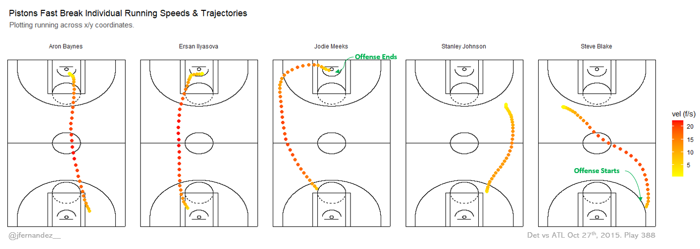
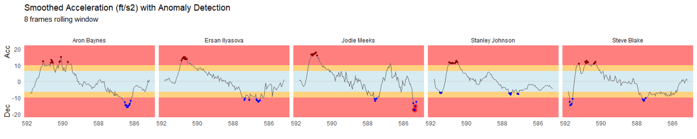
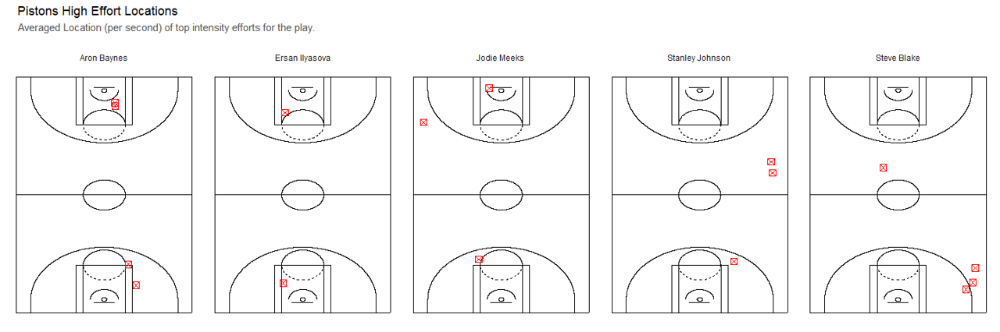
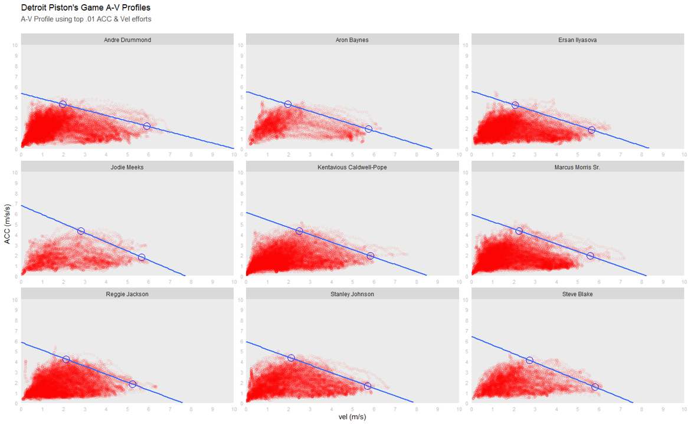

# sportVU NBA Athlete Tracking

A working document looking at different physical metrics that can be derived from NBA plays using [SportVU](https://www.nbastuffer.com/analytics101/sportvu-data/) tracking data. 

### Dashboard Example

Below is a dashboard looking at the motion of the actual play along with calculated acceleration and running speed for the Detroit Pistons players. 

  

### Data

SportVU in no longer used in the NBA, however a subset of games for the 2015/16 season can be found [here](https://github.com/rajshah4/BasketballData/tree/master/2016.NBA.Raw.SportVU.Game.Logs)

### Importing data

After downloading the games of interest to our working directory, I will import the data using the [sportvu_df()](https://rdrr.io/github/imadmali/NBAsportvu/man/sportvu_df.html) function. It also converts the data from json to a data frame. 

For this example I will use the Pistons vs Hawks game on Oct 27th, 2015 (id: 0021500001). Videohighlights available [here](https://www.youtube.com/watch?v=dNtmLm5D7dI). I randomly chose play id 388 consisting of a fast break for the Pistons resulting in a driving layup by Jodie Meeks.

To speed things up, I am only looking at this one play for this example but the calculations could easily be aggregated over time to look at demands over longer periods or for multiple games.

### Workflow

* Data import and variable selection
* Import game logs and play-by-play data using NBAstatR package
* Data cleaning, tidying and perform a join to the play-by-play data using NBAstatR.
* Create an animated visual of the play
* Distance, Acceleration and Running speed calculations
* Create various visuals of these metrics

*All code available [here](https://github.com/josedv82/sportVU_NBA_Tracking/blob/master/SportVU.Rmd)*

### To Do

* Add metabolic power calculations
* Look at peak demands for acceleration and speed for different periods of the game. Similar to this [study](https://pubmed.ncbi.nlm.nih.gov/26023738/)  
* Smoothing and over-sampling of data to minimise noise and help get more accurate calculations and identify appropriate smoothing windows.
* Small shiny app that let users choose a game, filter by play and visualize all plots as well as summaries of distance, time, mean and top running speed.

### Limitations

I haven't spent much time with these data, but some limitations I found were **1)** there are 25 data points per second, however there seems to be some noisy time intervals, which will affect the calculations of the above metrics. Maybe smoothing the time intervals and over-sampling afterwards may be required and **2)** the sportVU and play-by-play data do not align for all plays, meaning there is a mismatch in some cases or even some plays missing, which limits the ability to calculate demands for longer periods of time or across plays, quarters, etc...

### Some other examples of visuals

##### 1. Individual running speeds for the offensive part of the play id: 388

##### 2. Smoothed Acceleration + anomaly detection for play id: 388

##### 3. Location of High Intensity Efforts (ACC/DEC) based on above anomaly plot for play id: 388

##### 4. A-V (Acc-Vel) Profiles  - inspired on JB Morin's [work](https://jbmorin.net/2020/08/02/the-in-situ-sprint-profile-for-team-sports-testing-players-without-testing-them/)

`Disclaimer: I am still reviewing the process and some of the assumptions I made to create these A-V profiles. Just showing present work here but likely will change   over time.`

  
   
   
*Code for these images available [here](https://github.com/josedv82/sportVU_NBA_Tracking/blob/master/SportVU.Rmd)*

### Further Reading / acknowledgements

* Rajiv Shah's [github page](https://github.com/rajshah4) is a great resource and highly recommended.
* While I could not attend the conference, [Dean Little](https://twitter.com/DeanLittle) presented some [very interesting work](https://twitter.com/Bballphysio/status/1256376460593381376) in this area along with practical applications at IPS2020 conference.
* Reference for [equations](https://dash.harvard.edu/bitstream/handle/1/38811493/CHASE-SENIORTHESIS-2017.pdf?sequence=3)
* Further reading on creating this type of A-V profiles [here](https://jbmorin.net/2020/08/02/the-in-situ-sprint-profile-for-team-sports-testing-players-without-testing-them/)

